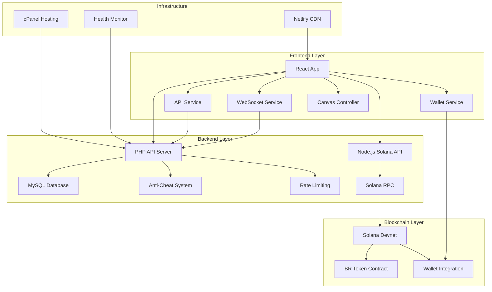
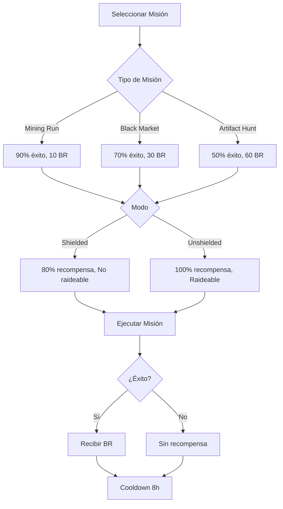
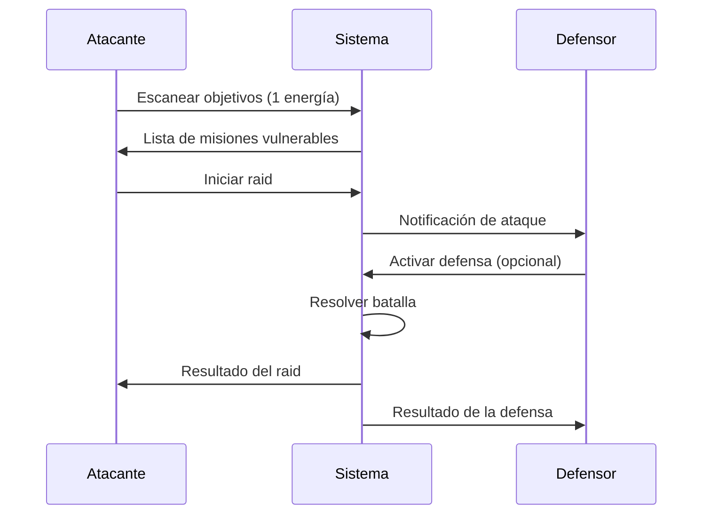
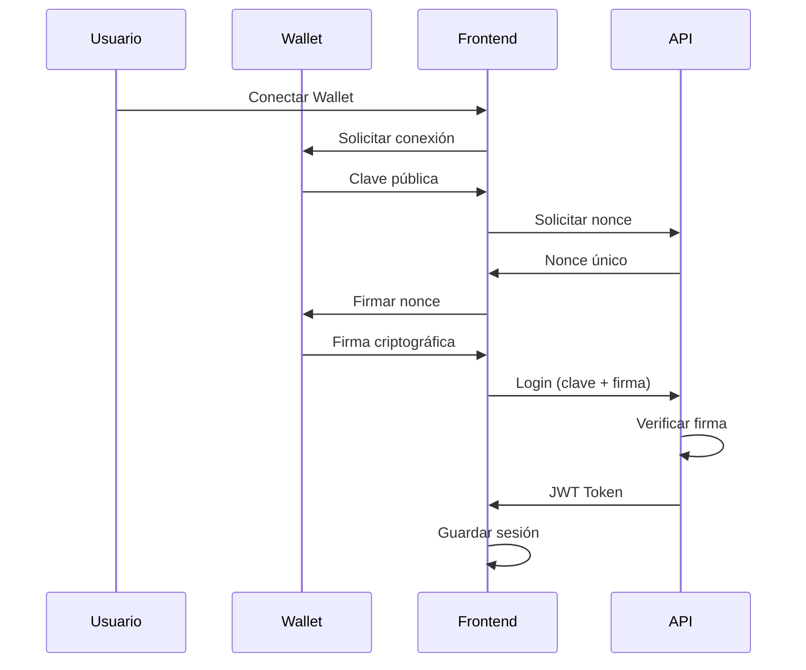
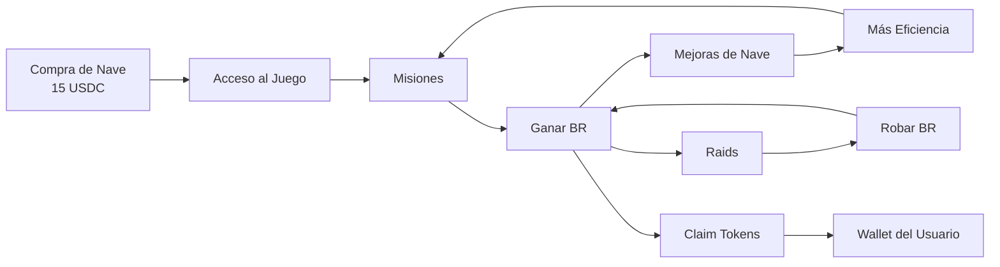
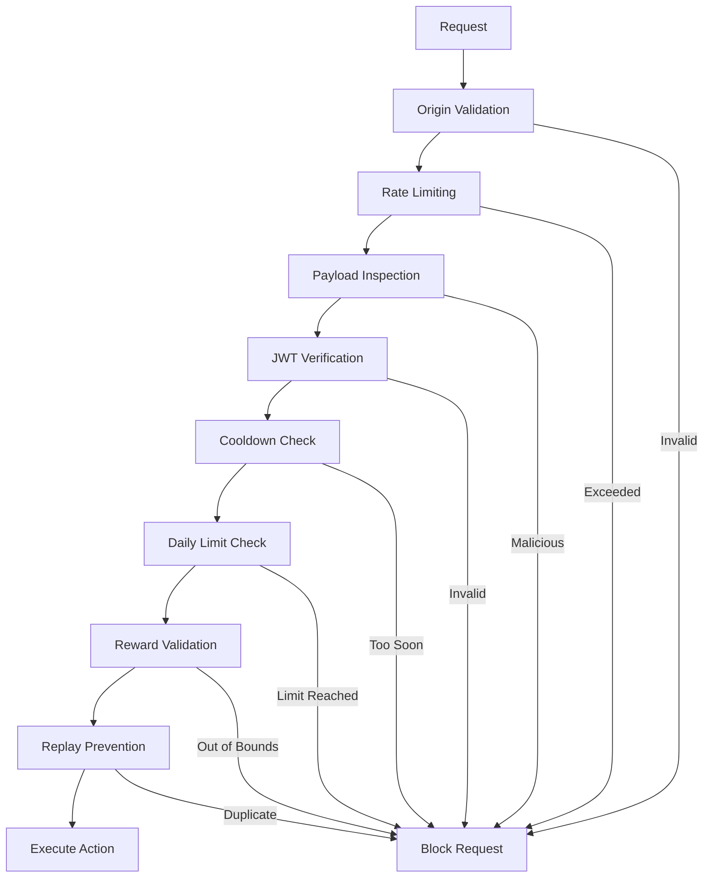
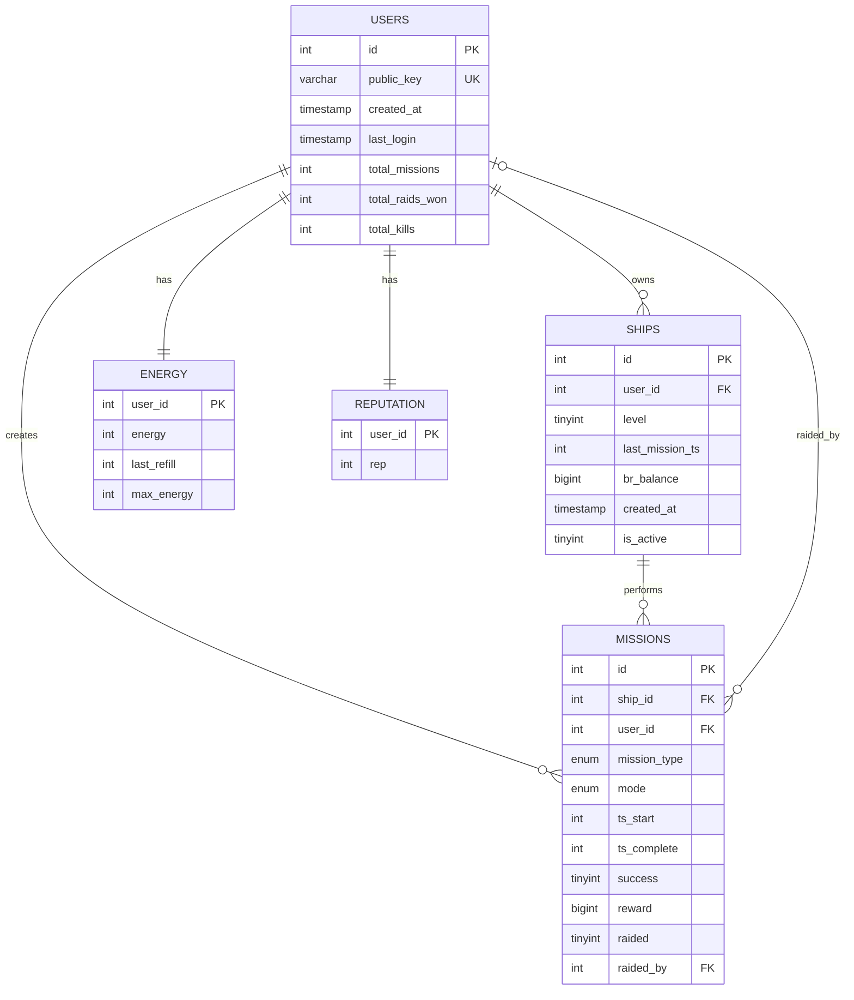
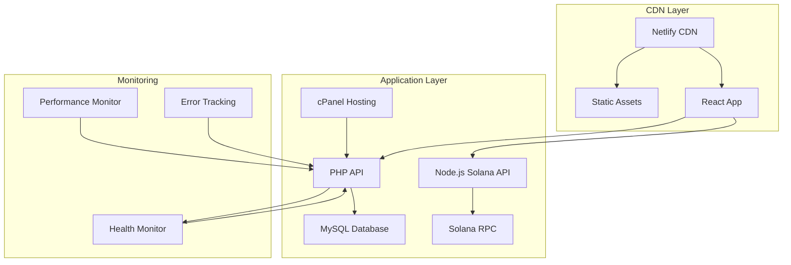
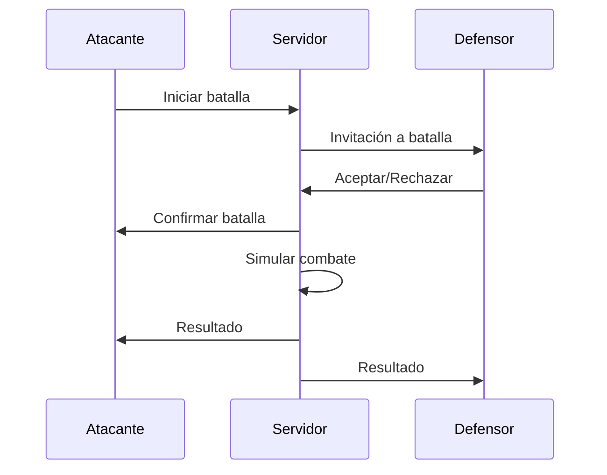

# 🚀 Bonk Raiders - Blockchain Space Raiding Game

```
 _______     ______    _____  ___   __   ___                                     
|   _  "\   /    " \  (\"   \|"  \ |/"| /  ")                                    
(. |_)  :) // ____  \ |.\\   \    |(: |/   /                                     
|:     \/ /  /    ) :)|: \.   \\  ||    __/                                      
(|  _  \\(: (____/ // |.  \    \. |(// _  \                                      
|: |_)  :)\        /  |    \    \ ||: | \  \                                     
(_______/  \"_____/    \___|\____\)(__|  \__)                                    
                                                                                 
      _______        __        __     ________    _______   _______    ________  
     /"      \      /""\      |" \   |"      "\  /"     "| /"      \  /"       ) 
    |:        |    /    \     ||  |  (.  ___  :)(: ______)|:        |(:   \___/  
    |_____/   )   /' /\  \    |:  |  |: \   ) || \/    |  |_____/   ) \___  \    
     //      /   //  __'  \   |.  |  (| (___\ || // ___)_  //      /   __/  \\   
    |:  __   \  /   /  \\  \  /\  |\ |:       :)(:      "||:  __   \  /" \   :)  
    |__|  \___)(___/    \___)(__\_|_)(________/  \_______)|__|  \___)(_______/   
```

## 📋 Tabla de Contenidos

- [🎮 Descripción del Proyecto](#-descripción-del-proyecto)
- [🏗️ Arquitectura del Sistema](#️-arquitectura-del-sistema)
- [🛠️ Stack Tecnológico](#️-stack-tecnológico)
- [📁 Estructura del Proyecto](#-estructura-del-proyecto)
- [🎯 Características Principales](#-características-principales)
- [🔧 Configuración e Instalación](#-configuración-e-instalación)
- [🎮 Mecánicas de Juego](#-mecánicas-de-juego)
- [🔐 Sistema de Autenticación](#-sistema-de-autenticación)
- [💰 Economía del Juego](#-economía-del-juego)
- [🌐 APIs y Servicios](#-apis-y-servicios)
- [🎨 Interfaz de Usuario](#-interfaz-de-usuario)
- [🔒 Seguridad](#-seguridad)
- [📊 Base de Datos](#-base-de-datos)
- [🚀 Despliegue](#-despliegue)
- [🐛 Debugging y Logs](#-debugging-y-logs)
- [📈 Estado Actual](#-estado-actual)
- [🔮 Próximos Pasos](#-próximos-pasos)
- [🤝 Contribución](#-contribución)

## 🎮 Descripción del Proyecto

**Bonk Raiders** es un juego de estrategia espacial en tiempo real construido sobre la blockchain de Solana. Los jugadores pueden:

- 🛸 **Comprar y mejorar naves espaciales**
- 🎯 **Realizar misiones para ganar tokens BR**
- ⚔️ **Atacar misiones de otros jugadores**
- 🛡️ **Defender su base de ataques enemigos**
- 💰 **Gestionar una economía basada en tokens**

El juego combina elementos de estrategia, gestión de recursos y mecánicas PvP en un entorno blockchain descentralizado.

## 🏗️ Arquitectura del Sistema



## 🛠️ Stack Tecnológico

### Frontend
- **React 18** - Framework principal
- **Vite** - Build tool y dev server
- **Vanilla CSS** - Estilos con tema retro pixelado
- **Canvas API** - Renderizado del juego isométrico
- **@solana/web3.js** - Integración con Solana

### Backend
- **PHP 7.4+** - API REST principal
- **MySQL/MariaDB** - Base de datos principal
- **Node.js** - Microservicio para Solana
- **JWT** - Autenticación sin estado

### Blockchain
- **Solana Devnet** - Red blockchain
- **SPL Tokens** - Tokens BR del juego
- **Phantom/Solflare** - Wallets soportadas

### Infraestructura
- **Netlify** - Hosting del frontend
- **cPanel** - Hosting del backend
- **WebSockets** - Comunicación en tiempo real

## 📁 Estructura del Proyecto

```
bonk-raiders/
├── 📁 src/                          # Frontend React
│   ├── 📁 components/               # Componentes React
│   │   ├── 📁 modals/              # Modales del juego
│   │   ├── GameCanvas.jsx          # Canvas principal
│   │   ├── GameUI.jsx              # Interfaz de usuario
│   │   └── HeroScreen.jsx          # Pantalla de inicio
│   ├── 📁 services/                # Servicios del cliente
│   │   ├── apiService.js           # Cliente API REST
│   │   ├── walletService.js        # Gestión de wallets
│   │   ├── websocketService.js     # WebSockets
│   │   └── sessionManager.js       # Gestión de sesiones
│   ├── 📁 utils/                   # Utilidades
│   │   ├── canvasController.js     # Lógica del canvas
│   │   ├── gameLogic.js            # Lógica principal
│   │   └── shipAnimator.js         # Animaciones
│   └── 📁 config/                  # Configuración
│       └── environment.js          # Variables de entorno
├── 📁 Server/                       # Backend PHP
│   ├── api.php                     # API principal
│   ├── anti_cheat.php              # Sistema anti-trampas
│   ├── hacker_protect.php          # Protección de seguridad
│   └── 📁 solana-api/              # Microservicio Node.js
├── 📁 database/                     # Esquemas de BD
│   └── migrations.sql              # Migraciones SQL
├── 📁 public/                       # Assets estáticos
│   └── 📁 assets/                  # Sprites e imágenes
└── 📁 app/                         # Versión vanilla (legacy)
```

## 🎯 Características Principales

### ✅ Implementadas

#### 🎮 Sistema de Juego
- [x] **Canvas isométrico** con renderizado 2.5D
- [x] **Animaciones de naves** (despegue, viaje, aterrizaje)
- [x] **Sistema de batallas** con soldados y mechs
- [x] **Efectos visuales** y partículas

#### 🔐 Autenticación
- [x] **Múltiples wallets** (Phantom, Solflare, Glow, etc.)
- [x] **Autenticación por firma** criptográfica
- [x] **JWT tokens** con renovación automática
- [x] **Gestión de sesiones** persistentes

#### 🎯 Mecánicas de Juego
- [x] **3 tipos de misiones** (Mining, Black Market, Artifact Hunt)
- [x] **2 modos de misión** (Shielded/Unshielded)
- [x] **Sistema de raids** entre jugadores
- [x] **7 niveles de mejoras** de nave
- [x] **Sistema de energía** para raids

#### 💰 Economía
- [x] **Tokens BR** como moneda del juego
- [x] **Compra de naves** (15 USDC equivalente)
- [x] **Recompensas por misiones** exitosas
- [x] **Robo de tokens** mediante raids

#### 🛡️ Seguridad
- [x] **Sistema anti-trampas** robusto
- [x] **Rate limiting** por IP
- [x] **Validación de origen** de requests
- [x] **Prevención de replay** de transacciones

### 🔄 En Desarrollo

#### 🌐 Comunicación en Tiempo Real
- [ ] **WebSocket server** funcional
- [ ] **Notificaciones de raids** en vivo
- [ ] **Estado de jugadores** en tiempo real
- [ ] **Chat del juego**

#### 🎮 Características Avanzadas
- [ ] **Batallas PvP** en tiempo real
- [ ] **Guilds/Alianzas** de jugadores
- [ ] **Eventos especiales** temporales
- [ ] **Leaderboards** globales

## 🔧 Configuración e Instalación

### Prerrequisitos

```bash
# Node.js 16+
node --version

# npm o yarn
npm --version

# PHP 7.4+
php --version

# MySQL/MariaDB
mysql --version
```

### 1. Configuración del Frontend

```bash
# Clonar el repositorio
git clone <repository-url>
cd bonk-raiders

# Instalar dependencias
npm install

# Configurar variables de entorno
cp .env.example .env
```

**Variables de entorno (.env):**
```env
# API Configuration
VITE_API_BASE_URL=https://api.bonkraiders.com
VITE_VERIFY_API_URL=https://verify.bonkraiders.com

# Solana Configuration
VITE_SOLANA_RPC_URL=https://api.devnet.solana.com
VITE_SOLANA_NETWORK=devnet

# Game Configuration
VITE_GAME_TOKEN_MINT=CCmGDrD9jZarDEz1vrjKcE9rrJjL8VecDYjAWxhwhGPo
VITE_SHIP_PRICE_SOL=0.01

# Development
VITE_DEBUG_MODE=true
```

### 2. Configuración del Backend

```php
// Server/api.php - Configuración de base de datos
define('DB_HOST', 'localhost');
define('DB_NAME', 'bonka_bonkartio');
define('DB_USER', 'tu_usuario');
define('DB_PASS', 'tu_contraseña');
define('JWT_SECRET', 'tu_jwt_secret_muy_seguro');
```

### 3. Base de Datos

```sql
-- Ejecutar migraciones
mysql -u usuario -p bonka_bonkartio < database/migrations.sql
```

### 4. Ejecutar en Desarrollo

```bash
# Frontend
npm run dev

# Backend (si usas servidor local)
php -S localhost:8000 Server/api.php
```

## 🎮 Mecánicas de Juego

### 🚀 Sistema de Misiones



### ⚔️ Sistema de Raids



### 🛠️ Sistema de Mejoras

| Nivel | Bonus | Cooldown | Costo | Total Acumulado |
|-------|-------|----------|-------|-----------------|
| 1     | 1.0×  | 8h       | -     | 0 BR           |
| 2     | 1.1×  | 7.5h     | 50 BR | 50 BR          |
| 3     | 1.2×  | 7h       | 100 BR| 150 BR         |
| 4     | 1.3×  | 6.5h     | 150 BR| 300 BR         |
| 5     | 1.45× | 6h       | 225 BR| 525 BR         |
| 6     | 1.6×  | 5.5h     | 300 BR| 825 BR         |
| 7     | 1.8×  | 5h       | 400 BR| 1,225 BR       |

## 🔐 Sistema de Autenticación

### Flujo de Autenticación



### Wallets Soportadas

- **Phantom** - Wallet principal recomendada
- **Solflare** - Wallet web y extensión
- **Glow** - Wallet móvil y web
- **Backpack** - Wallet social
- **Coin98** - Wallet multi-chain

## 💰 Economía del Juego

### Token BR (Bonk Raiders)



### Fuentes de Ingresos BR

1. **Misiones Exitosas**
   - Mining Run: 10 BR (90% éxito)
   - Black Market: 30 BR (70% éxito)
   - Artifact Hunt: 60 BR (50% éxito)

2. **Raids Exitosos**
   - Robar 100% de la recompensa de misión
   - Solo misiones Unshielded

3. **Defensa Exitosa**
   - Bonus por repeler ataques
   - Mantener recompensas propias

### Gastos BR

1. **Mejoras de Nave**
   - Niveles 2-7: 50-400 BR por nivel

2. **Futuras Características**
   - Equipamiento especial
   - Consumibles de batalla
   - Cosméticos de nave

## 🌐 APIs y Servicios

### API REST Principal (PHP)

**Base URL:** `https://api.bonkraiders.com/api.php`

#### Autenticación
```http
POST /api.php?action=auth/nonce
Content-Type: application/json

{
  "publicKey": "string"
}
```

```http
POST /api.php?action=auth/login
Content-Type: application/json

{
  "publicKey": "string",
  "nonce": "string",
  "signature": "string"
}
```

#### Juego
```http
POST /api.php?action=buy_ship
Authorization: Bearer <jwt_token>
```

```http
POST /api.php?action=send_mission
Authorization: Bearer <jwt_token>
Content-Type: application/json

{
  "type": "MiningRun|BlackMarket|ArtifactHunt",
  "mode": "Shielded|Unshielded",
  "signedBurnTx": "string"
}
```

```http
POST /api.php?action=upgrade_ship
Authorization: Bearer <jwt_token>
Content-Type: application/json

{
  "level": 2-7
}
```

```http
POST /api.php?action=raid_mission
Authorization: Bearer <jwt_token>
Content-Type: application/json

{
  "mission_id": "integer"
}
```

```http
POST /api.php?action=raid/scan
Authorization: Bearer <jwt_token>
```

```http
POST /api.php?action=claim_rewards
Authorization: Bearer <jwt_token>
```

### Microservicio Solana (Node.js)

**Base URL:** `https://verify.bonkraiders.com`

```http
POST /verify
Content-Type: application/json

{
  "publicKey": "string",
  "message": "string", 
  "signature": "string"
}
```

### WebSocket API (En Desarrollo)

**URL:** `wss://api.bonkraiders.com/ws`

#### Eventos del Cliente
```json
{
  "type": "raid_initiated",
  "data": {
    "targetMissionId": "integer",
    "timestamp": "number"
  }
}
```

#### Eventos del Servidor
```json
{
  "type": "raid_incoming",
  "data": {
    "attackerId": "integer",
    "attackerName": "string",
    "missionType": "string",
    "estimatedReward": "number"
  }
}
```

## 🎨 Interfaz de Usuario

### Diseño Retro-Futurista

- **Fuente:** Press Start 2P (pixel perfect)
- **Paleta de colores:** Verde neón (#0f0), Cian (#0cf), Amarillo (#ff0)
- **Estilo:** Interfaz de terminal espacial
- **Animaciones:** Transiciones suaves con efectos de brillo

### Componentes Principales

#### 🏠 Pantalla de Inicio (HeroScreen)
- Detección automática de wallets
- Botones de conexión dinámicos
- Fondo animado con efectos parallax

#### 🎮 Interfaz de Juego (GameUI)
- **Top HUD:** Wallet, Balance, Stats
- **Canvas:** Vista isométrica del juego
- **Bottom HUD:** Botones de acción
- **Modales:** Misiones, Raids, Mejoras, etc.

#### 🖼️ Canvas Isométrico
- Renderizado 2.5D con sprites pixelados
- Animaciones de naves y batallas
- Sistema de cámara con pan y zoom
- Efectos de partículas y proyectiles

### Responsive Design

```css
/* Desktop */
@media (min-width: 601px) {
  .top-hud { flex-direction: row; }
  .action-btn { min-width: 80px; }
}

/* Mobile */
@media (max-width: 600px) {
  .top-hud { flex-direction: column; }
  .action-btn { min-width: 60px; }
  .bottom-hud { position: fixed; bottom: 0; }
}
```

## 🔒 Seguridad

### Sistema Anti-Trampas



### Medidas de Protección

#### 🛡️ Validación de Entrada
```php
// Anti-injection filters
$badPatterns = [
    'eval(', 'base64_decode', 'shell_exec',
    'union select', '<?php', '--'
];

// Control character blocking
if (preg_match('/[\x00-\x08\x0B\x0C\x0E-\x1F]/', $input)) {
    throw new Exception('Invalid characters detected');
}
```

#### ⏱️ Rate Limiting
```php
// 60 requests per minute per IP
const RATE_LIMIT = 60;
const WINDOW = 60; // seconds

if ($requestCount > RATE_LIMIT) {
    http_response_code(429);
    exit('Rate limit exceeded');
}
```

#### 🔄 Cooldown Enforcement
```php
const COOLDOWN_SECONDS = 8 * 3600; // 8 hours

if (time() - $lastMissionTime < COOLDOWN_SECONDS) {
    throw new Exception('Cooldown violation');
}
```

#### 📊 Daily Limits
```php
const DAILY_MISSION_LIMIT = 10;

if ($todayMissions >= DAILY_MISSION_LIMIT) {
    throw new Exception('Daily limit reached');
}
```

### Headers de Seguridad

```php
// CSP Policy
header('Content-Security-Policy: ' .
    "default-src 'self'; " .
    "script-src 'self' 'unsafe-inline'; " .
    "connect-src 'self' https://api.bonkraiders.com; " .
    "object-src 'none';"
);

// Security headers
header('X-Frame-Options: DENY');
header('X-Content-Type-Options: nosniff');
header('X-XSS-Protection: 1; mode=block');
```

## 📊 Base de Datos

### Esquema de Entidades



### Tablas Principales

#### 👥 Users
```sql
CREATE TABLE users (
  id INT AUTO_INCREMENT PRIMARY KEY,
  public_key VARCHAR(64) NOT NULL UNIQUE,
  created_at TIMESTAMP DEFAULT CURRENT_TIMESTAMP,
  last_login TIMESTAMP DEFAULT CURRENT_TIMESTAMP,
  total_missions INT NOT NULL DEFAULT 0,
  total_raids_won INT NOT NULL DEFAULT 0,
  total_kills INT NOT NULL DEFAULT 0,
  INDEX idx_public_key (public_key)
);
```

#### 🚀 Ships
```sql
CREATE TABLE ships (
  id INT AUTO_INCREMENT PRIMARY KEY,
  user_id INT NOT NULL,
  level TINYINT NOT NULL DEFAULT 1,
  last_mission_ts INT NOT NULL DEFAULT 0,
  br_balance BIGINT NOT NULL DEFAULT 0,
  created_at TIMESTAMP DEFAULT CURRENT_TIMESTAMP,
  is_active TINYINT NOT NULL DEFAULT 1,
  FOREIGN KEY(user_id) REFERENCES users(id)
);
```

#### 🎯 Missions
```sql
CREATE TABLE missions (
  id INT AUTO_INCREMENT PRIMARY KEY,
  ship_id INT NOT NULL,
  user_id INT NOT NULL,
  mission_type ENUM('MiningRun','BlackMarket','ArtifactHunt') NOT NULL,
  mode ENUM('Shielded','Unshielded') NOT NULL,
  ts_start INT NOT NULL,
  ts_complete INT NULL,
  success TINYINT NOT NULL,
  reward BIGINT NOT NULL,
  raided TINYINT NOT NULL DEFAULT 0,
  raided_by INT NULL,
  FOREIGN KEY(ship_id) REFERENCES ships(id),
  FOREIGN KEY(user_id) REFERENCES users(id)
);
```

### Optimizaciones de Performance

#### Índices Estratégicos
```sql
-- Búsquedas frecuentes
INDEX idx_user_missions (user_id, ts_start);
INDEX idx_raidable_missions (mode, raided, ts_complete);
INDEX idx_active_ships (user_id, is_active);

-- Rate limiting
INDEX idx_api_logs_ip_ts (ip, ts);
```

#### Consultas Optimizadas
```sql
-- Misiones raideables (con FORCE INDEX)
SELECT m.*, u.public_key 
FROM missions m 
FORCE INDEX (idx_raidable_missions)
JOIN users u ON m.user_id = u.id
WHERE m.mode = 'Unshielded' 
  AND m.raided = 0 
  AND m.success = 1
ORDER BY m.reward DESC 
LIMIT 10;
```

## 🚀 Despliegue

### Arquitectura de Producción



### Proceso de Despliegue

#### 1. Frontend (Netlify)
```bash
# Build para producción
npm run build

# Deploy automático via Git
git push origin main

# Netlify auto-deploys from main branch
```

#### 2. Backend (cPanel)
```bash
# Subir archivos via FTP/File Manager
Server/api.php → public_html/api.php
Server/anti_cheat.php → public_html/anti_cheat.php
Server/hacker_protect.php → public_html/hacker_protect.php

# Configurar base de datos
mysql -u usuario -p < database/migrations.sql
```

#### 3. Variables de Entorno
```env
# Producción
VITE_API_BASE_URL=https://api.bonkraiders.com
VITE_SOLANA_NETWORK=mainnet-beta
VITE_DEBUG_MODE=false
```

### Monitoreo y Mantenimiento

#### Health Checks
```php
// Endpoint: /health
{
  "status": "healthy|warning|critical",
  "checks": {
    "database": { "status": "healthy", "response_time": 45 },
    "performance": { "status": "healthy", "avg_response_time": 0.8 },
    "cache": { "status": "healthy", "hit_rate": 0.85 }
  },
  "auto_healing": [
    { "action": "cache_clear", "status": "completed" }
  ]
}
```

#### Performance Monitoring
```javascript
// Client-side monitoring
const performanceMonitor = {
  trackApiCall: (endpoint, duration) => {
    if (duration > 2000) {
      console.warn(`Slow API call: ${endpoint} took ${duration}ms`);
    }
  },
  
  trackError: (error, context) => {
    // Send to monitoring service
    fetch('/api/errors', {
      method: 'POST',
      body: JSON.stringify({ error, context, timestamp: Date.now() })
    });
  }
};
```

## 🐛 Debugging y Logs

### Sistema de Logging

#### Frontend (Debug Mode)
```javascript
if (ENV.DEBUG_MODE) {
  console.log('🔍 API Request:', { url, method, data });
  console.log('📡 API Response:', response);
  console.log('🎮 Game State:', gameState);
}
```

#### Backend (PHP)
```php
if (DEBUG_MODE) {
    error_log("[" . date('c') . "] API Call: $action by $userId");
    error_log("Request data: " . json_encode($requestData));
    error_log("Response: " . json_encode($response));
}
```

### Herramientas de Debug

#### 1. Health Check Script
```bash
# Verificar estado del sistema
curl https://api.bonkraiders.com/health
```

#### 2. Database Check
```bash
# Verificar estructura de BD
php Server/check_setup.php
```

#### 3. Performance Analysis
```sql
-- Consultas lentas
SELECT * FROM api_logs 
WHERE response_time > 2000 
ORDER BY ts DESC 
LIMIT 10;
```

### Errores Comunes y Soluciones

#### 🔐 Error de Autenticación
```
Error: "Invalid JWT signature"
Solución: Verificar JWT_SECRET en servidor
```

#### 🌐 Error de CORS
```
Error: "CORS policy blocked"
Solución: Verificar headers en api.php
```

#### 💾 Error de Base de Datos
```
Error: "Table doesn't exist"
Solución: Ejecutar migrations.sql
```

#### ⚡ Error de WebSocket
```
Error: "WebSocket connection failed"
Solución: Usar mock WebSocket en desarrollo
```

## 📈 Estado Actual

### ✅ Completado (90%)

#### Core Systems
- [x] **Autenticación completa** - Multi-wallet con JWT
- [x] **Sistema de misiones** - 3 tipos, 2 modos
- [x] **Sistema de raids** - PvP con energía
- [x] **Mejoras de nave** - 7 niveles
- [x] **Economía BR** - Tokens, recompensas, gastos
- [x] **Canvas isométrico** - Renderizado 2.5D
- [x] **Animaciones** - Naves, batallas, efectos
- [x] **Anti-cheat** - Múltiples capas de seguridad
- [x] **API REST** - Endpoints completos
- [x] **Base de datos** - Esquema optimizado
- [x] **Frontend React** - UI completa y responsive
- [x] **Despliegue** - Netlify + cPanel

#### Security & Performance
- [x] **Rate limiting** - 60 req/min por IP
- [x] **Input validation** - Anti-injection
- [x] **Cooldown enforcement** - 8h entre misiones
- [x] **Daily limits** - 10 misiones/día
- [x] **Health monitoring** - Auto-healing
- [x] **Performance tracking** - Métricas en tiempo real
- [x] **Error handling** - Logging completo

### 🔄 En Progreso (10%)

#### Real-time Features
- [ ] **WebSocket server** - Comunicación en vivo
- [ ] **Notificaciones push** - Raids, eventos
- [ ] **Estado de jugadores** - Online/offline
- [ ] **Chat del juego** - Comunicación entre jugadores

#### Advanced Features
- [ ] **Batallas PvP** - Combate en tiempo real
- [ ] **Guilds/Alianzas** - Cooperación entre jugadores
- [ ] **Eventos especiales** - Contenido temporal
- [ ] **Leaderboards** - Rankings globales

### 📊 Métricas de Desarrollo

| Componente | Progreso | Estado |
|------------|----------|--------|
| Frontend React | 95% | ✅ Completo |
| Backend PHP | 90% | ✅ Completo |
| Base de Datos | 100% | ✅ Completo |
| Autenticación | 100% | ✅ Completo |
| Game Logic | 85% | ✅ Completo |
| Security | 95% | ✅ Completo |
| WebSockets | 20% | 🔄 En progreso |
| Mobile UI | 80% | ✅ Funcional |
| Performance | 90% | ✅ Optimizado |
| Documentation | 95% | ✅ Completo |

## 🔮 Próximos Pasos

### Fase 1: Completar WebSockets (Enero 2025)

#### 🌐 Servidor WebSocket
```javascript
// Implementar servidor Node.js
const WebSocket = require('ws');
const wss = new WebSocket.Server({ port: 8080 });

wss.on('connection', (ws, req) => {
  // Autenticación via JWT
  // Manejo de eventos de raid
  // Notificaciones en tiempo real
});
```

#### 📱 Notificaciones Push
- Raids entrantes
- Misiones completadas
- Eventos especiales
- Mensajes de guild

### Fase 2: Características Avanzadas (Febrero 2025)

#### ⚔️ Batallas PvP en Tiempo Real


#### 🏰 Sistema de Guilds
- Crear/unirse a alianzas
- Chat de guild
- Misiones cooperativas
- Guerras entre guilds

### Fase 3: Expansión del Contenido (Marzo 2025)

#### 🎪 Eventos Especiales
- Eventos semanales con recompensas únicas
- Torneos de raids
- Misiones de temporada
- Jefes mundiales cooperativos

#### 🏆 Sistema de Logros
```sql
CREATE TABLE achievements (
  id INT AUTO_INCREMENT PRIMARY KEY,
  user_id INT NOT NULL,
  achievement_type VARCHAR(50) NOT NULL,
  progress INT NOT NULL DEFAULT 0,
  completed TINYINT NOT NULL DEFAULT 0,
  completed_at TIMESTAMP NULL
);
```

### Fase 4: Optimización y Escalabilidad (Abril 2025)

#### 🚀 Performance Improvements
- Implementar Redis para caché
- Optimizar consultas de base de datos
- CDN para assets del juego
- Lazy loading de componentes

#### 📱 Mobile App
- React Native wrapper
- Notificaciones push nativas
- Optimizaciones táctiles
- App Store deployment

### Roadmap a Largo Plazo (2025-2026)

#### Q2 2025: Mainnet Launch
- Migración a Solana Mainnet
- Auditoría de seguridad completa
- Marketing y adquisición de usuarios
- Programa de referidos

#### Q3 2025: Advanced Features
- Marketplace de NFTs
- Naves personalizables
- Territorios conquistables
- Economía DeFi integrada

#### Q4 2025: Ecosystem Expansion
- API pública para desarrolladores
- Integración con otros juegos
- DAO governance
- Staking de tokens BR

#### 2026: Metaverse Integration
- Mundos 3D explorables
- VR/AR compatibility
- Cross-chain bridges
- AI-powered NPCs

## 🤝 Contribución

### Estructura de Desarrollo

#### 🔧 Setup de Desarrollo
```bash
# Fork del repositorio
git clone https://github.com/tu-usuario/bonk-raiders.git
cd bonk-raiders

# Instalar dependencias
npm install

# Configurar entorno de desarrollo
cp .env.example .env.local

# Ejecutar en modo desarrollo
npm run dev
```

#### 📝 Estándares de Código

**JavaScript/React:**
```javascript
// Usar ES6+ features
const handleMission = async (type, mode) => {
  try {
    const result = await apiService.sendMission(type, mode);
    return result;
  } catch (error) {
    console.error('Mission failed:', error);
    throw error;
  }
};
```

**PHP:**
```php
// Seguir PSR-12 standards
class MissionController 
{
    public function sendMission(array $data): array
    {
        $this->validateMissionData($data);
        return $this->executeMission($data);
    }
}
```

#### 🧪 Testing Guidelines
```javascript
// Frontend tests
describe('Mission System', () => {
  test('should start mission successfully', async () => {
    const result = await startMission('MiningRun', 'Unshielded');
    expect(result.success).toBe(true);
  });
});
```

#### 📋 Pull Request Process
1. **Fork** el repositorio
2. **Crear** branch feature (`git checkout -b feature/nueva-caracteristica`)
3. **Commit** cambios (`git commit -m 'Add: nueva característica'`)
4. **Push** al branch (`git push origin feature/nueva-caracteristica`)
5. **Abrir** Pull Request con descripción detallada

### Áreas de Contribución

#### 🎮 Game Development
- Nuevas mecánicas de juego
- Balanceo de economía
- Optimizaciones de performance
- Efectos visuales y animaciones

#### 🔒 Security & Infrastructure
- Auditorías de seguridad
- Optimizaciones de base de datos
- Monitoreo y alertas
- Documentación técnica

#### 🎨 UI/UX Design
- Mejoras de interfaz
- Responsive design
- Accesibilidad
- Experiencia de usuario

#### 🌐 Backend Development
- API optimizations
- WebSocket implementation
- Database migrations
- Microservices architecture

---

## 📞 Soporte y Contacto

- **GitHub Issues:** Para reportar bugs y solicitar features
- **Discord:** Comunidad de desarrolladores y jugadores
- **Twitter:** [@BonkRaiders](https://twitter.com/BonkRaiders) para actualizaciones
- **Email:** dev@bonkraiders.com para consultas técnicas

---

**Bonk Raiders** - *Explore. Raid. Earn.* 🚀

*Construido con ❤️ por la comunidad blockchain gaming*
