# 🚀 Bonk Raiders - Blockchain Space Raiding Game

```
 _______     ______    _____  ___   __   ___                                     
|   _  "\   /    " \  (\"   \|"  \ |/"| /  ")                                    
(. |_)  :) // ____  \ |.\\   \    |(: |/   /                                     
|:     \/ /  /    ) :)|: \.   \\  ||    __/                                      
(|  _  \\(: (____/ // |.  \    \. |(// _  \                                      
|: |_)  :)\        /  |    \    \ ||: | \  \                                     
(_______/  \"_____/    \___|\____\)(__|  \__)                                    
                                                                                 
      _______        __        __     ________    _______   _______    ________  
     /"      \      /""\      |" \   |"      "\  /"     "| /"      \  /"       ) 
    |:        |    /    \     ||  |  (.  ___  :)(: ______)|:        |(:   \___/  
    |_____/   )   /' /\  \    |:  |  |: \   ) || \/    |  |_____/   ) \___  \    
     //      /   //  __'  \   |.  |  (| (___\ || // ___)_  //      /   __/  \\   
    |:  __   \  /   /  \\  \  /\  |\ |:       :)(:      "||:  __   \  /" \   :)  
    |__|  \___)(___/    \___)(__\_|_)(________/  \_______)|__|  \___)(_______/   
```

## 📋 Table of Contents

- [🎮 Project Overview](#-project-overview)
- [🏗️ System Architecture](#️-system-architecture)
- [🛠️ Technology Stack](#️-technology-stack)
- [📁 Project Structure](#-project-structure)
- [🎯 Core Features](#-core-features)
- [🔧 Setup & Installation](#-setup--installation)
- [🎮 Game Mechanics](#-game-mechanics)
- [🔐 Authentication System](#-authentication-system)
- [💰 Game Economy](#-game-economy)
- [🌐 APIs & Services](#-apis--services)
- [🎨 User Interface](#-user-interface)
- [🔒 Security](#-security)
- [📊 Database Schema](#-database-schema)
- [🚀 Deployment](#-deployment)
- [🐛 Debugging & Monitoring](#-debugging--monitoring)
- [📈 Current Status](#-current-status)
- [🔮 Roadmap](#-roadmap)
- [🤝 Contributing](#-contributing)

## 🎮 Project Overview

**Bonk Raiders** is a real-time space strategy game built on the Solana blockchain. Players can:

- 🛸 **Purchase and upgrade spaceships**
- 🎯 **Complete missions to earn BR tokens**
- ⚔️ **Raid other players' missions**
- 🛡️ **Defend their base from enemy attacks**
- 💰 **Manage a token-based economy**

The game combines strategy elements, resource management, and PvP mechanics in a decentralized blockchain environment with retro pixel art aesthetics.

## 🏗️ System Architecture

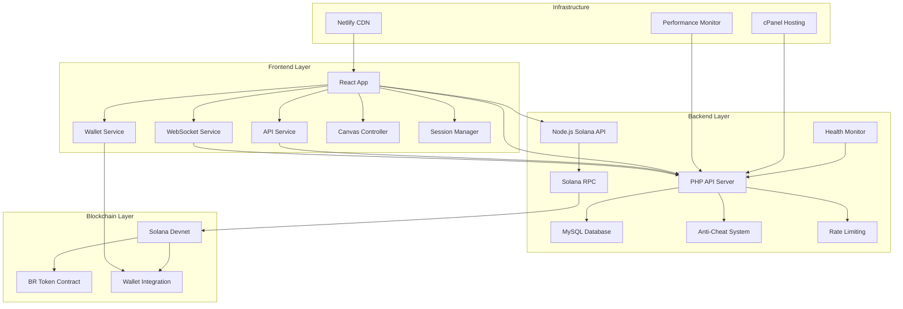

### Architecture Principles

1. **Separation of Concerns**: Frontend handles UI/UX, backend manages game logic and security
2. **Microservices**: Dedicated Solana API service for blockchain operations
3. **Real-time Communication**: WebSocket integration for live player interactions
4. **Security First**: Multi-layer anti-cheat and validation systems
5. **Scalability**: Modular design allows for easy feature expansion

## 🛠️ Technology Stack

### Frontend Technologies
- **React 18.3.1** - Modern UI framework with hooks
- **Vite 5.4.2** - Fast build tool and development server
- **Vanilla CSS** - Custom retro pixel art styling
- **Canvas API** - Isometric 2.5D game rendering
- **@solana/web3.js 1.95.2** - Solana blockchain integration

### Backend Technologies
- **PHP 7.4+** - Main REST API server
- **MySQL/MariaDB** - Primary database
- **Node.js** - Solana microservice
- **JWT** - Stateless authentication
- **WebSockets** - Real-time communication

### Blockchain Integration
- **Solana Devnet** - Blockchain network
- **SPL Tokens** - BR game tokens
- **Multiple Wallets** - Phantom, Solflare, Glow, Backpack, Coin98

### Infrastructure & DevOps
- **Netlify** - Frontend hosting and CDN
- **cPanel** - Backend hosting
- **Performance Monitoring** - Auto-healing systems
- **Health Checks** - System status monitoring

## 📁 Project Structure

```
bonk-raiders/
├── 📁 src/                          # React Frontend Application
│   ├── 📁 components/               # React Components
│   │   ├── 📁 modals/              # Game Modal Components
│   │   │   ├── MissionModal.jsx    # Mission selection interface
│   │   │   ├── RaidModal.jsx       # Raid targeting system
│   │   │   ├── UpgradeModal.jsx    # Ship upgrade interface
│   │   │   ├── ClaimModal.jsx      # Token claiming interface
│   │   │   └── HowToModal.jsx      # Game tutorial
│   │   ├── GameCanvas.jsx          # Main game canvas
│   │   ├── GameUI.jsx              # Game user interface
│   │   ├── HeroScreen.jsx          # Landing/connection screen
│   │   ├── Modal.jsx               # Modal container
│   │   └── Tooltip.jsx             # Interactive tooltips
│   ├── 📁 services/                # Client-side Services
│   │   ├── apiService.js           # REST API client
│   │   ├── walletService.js        # Wallet management
│   │   ├── websocketService.js     # Real-time communication
│   │   ├── sessionManager.js       # Session persistence
│   │   ├── userCacheService.js     # Local data caching
│   │   └── healthMonitor.js        # System health monitoring
│   ├── 📁 utils/                   # Utility Functions
│   │   ├── canvasController.js     # Game canvas logic
│   │   ├── gameLogic.js            # Core game mechanics
│   │   ├── shipAnimator.js         # Ship animations
│   │   ├── raidAnimations.js       # Raid visual effects
│   │   └── solanaTransactions.js   # Blockchain transactions
│   └── 📁 config/                  # Configuration
│       └── environment.js          # Environment variables
├── 📁 Server/                       # PHP Backend
│   ├── api.php                     # Main API endpoint
│   ├── anti_cheat.php              # Anti-cheat system
│   ├── hacker_protect.php          # Security protection
│   ├── performance_monitor.php     # Performance tracking
│   ├── health_check.php            # Health monitoring
│   └── 📁 solana-api/              # Node.js Microservice
│       ├── index.js                # Solana API server
│       └── package.json            # Node dependencies
├── 📁 database/                     # Database Schema
│   └── migrations.sql              # SQL migrations
├── 📁 public/                       # Static Assets
│   └── 📁 assets/                  # Game sprites and images
├── 📁 app/                         # Legacy Vanilla Implementation
└── 📁 supabase/                    # Database Migrations
    └── 📁 migrations/              # Supabase migration files
```

## 🎯 Core Features

### ✅ Implemented Features

#### 🎮 Game Systems
- [x] **Isometric Canvas Rendering** - 2.5D game world with pixel art
- [x] **Ship Animations** - Launch, travel, and landing sequences
- [x] **Battle System** - Real-time combat with soldiers and mechs
- [x] **Visual Effects** - Particles, explosions, and transitions
- [x] **Sound Integration** - Ready for audio implementation

#### 🔐 Authentication & Security
- [x] **Multi-Wallet Support** - Phantom, Solflare, Glow, Backpack, Coin98
- [x] **Cryptographic Authentication** - Signature-based login
- [x] **JWT Token Management** - Auto-renewal and session persistence
- [x] **Anti-Cheat System** - Server-side validation and protection
- [x] **Rate Limiting** - IP-based request throttling

#### 🎯 Game Mechanics
- [x] **3 Mission Types** - Mining Run, Black Market, Artifact Hunt
- [x] **2 Mission Modes** - Shielded (safe) vs Unshielded (raidable)
- [x] **Player vs Player Raids** - Attack other players' missions
- [x] **7-Tier Ship Upgrades** - Progressive enhancement system
- [x] **Energy System** - Limited raid attempts with hourly regeneration
- [x] **Cooldown Management** - Time-based mission restrictions

#### 💰 Economy & Tokens
- [x] **BR Token Integration** - In-game currency
- [x] **Ship Purchase System** - One-time 15 USDC equivalent
- [x] **Mission Rewards** - Token earnings from successful missions
- [x] **Raid Mechanics** - Steal tokens from other players
- [x] **Token Claiming** - Withdraw earnings to wallet

#### 🛡️ Security & Anti-Cheat
- [x] **Request Origin Validation** - CORS and referrer checking
- [x] **Payload Inspection** - Input sanitization and validation
- [x] **Replay Attack Prevention** - Transaction hash tracking
- [x] **Cooldown Enforcement** - Server-side timing validation
- [x] **Daily Limits** - Mission frequency restrictions

### 🔄 In Development

#### 🌐 Real-Time Features
- [ ] **WebSocket Server** - Live communication infrastructure
- [ ] **Raid Notifications** - Real-time attack alerts
- [ ] **Player Status** - Online/offline indicators
- [ ] **Live Chat System** - In-game communication

#### 🎮 Advanced Gameplay
- [ ] **Real-Time PvP Battles** - Live combat encounters
- [ ] **Guild System** - Player alliances and cooperation
- [ ] **Special Events** - Limited-time challenges
- [ ] **Global Leaderboards** - Competitive rankings
- [ ] **Achievement System** - Progress tracking and rewards

#### 🔧 Technical Improvements
- [ ] **Mobile Optimization** - Touch controls and responsive design
- [ ] **Performance Optimization** - Rendering and network improvements
- [ ] **Offline Mode** - Limited functionality without connection
- [ ] **Progressive Web App** - Installable game experience

## 🔧 Setup & Installation

### Prerequisites

```bash
# Node.js 16+ (Required for frontend)
node --version  # Should be 16.0.0 or higher

# npm or yarn (Package manager)
npm --version

# PHP 7.4+ (Required for backend)
php --version

# MySQL/MariaDB (Database)
mysql --version
```

### 1. Frontend Setup

```bash
# Clone the repository
git clone <repository-url>
cd bonk-raiders

# Install dependencies
npm install

# Copy environment configuration
cp .env.example .env
```

**Environment Variables (.env):**
```env
# API Configuration - Production URLs
VITE_API_BASE_URL=https://api.bonkraiders.com
VITE_VERIFY_API_URL=https://verify.bonkraiders.com

# Solana Configuration
VITE_SOLANA_RPC_URL=https://api.devnet.solana.com
VITE_SOLANA_NETWORK=devnet

# Game Token Configuration
VITE_GAME_TOKEN_MINT=CCmGDrD9jZarDEz1vrjKcE9rrJjL8VecDYjAWxhwhGPo
VITE_PARTICIPATION_FEE=0

# Ship Purchase Configuration  
VITE_SHIP_PRICE_SOL=0.01

# Asset URLs
VITE_ASSETS_BASE_URL=https://bonkraiders.com/assets

# Development Settings
VITE_DEBUG_MODE=true
VITE_MOCK_API=false

# Security
VITE_APP_VERSION=1.0.0
```

### 2. Backend Configuration

```php
// Server/api.php - Database Configuration
define('DB_HOST', 'localhost');
define('DB_NAME', 'bonka_bonkartio');
define('DB_USER', 'your_db_user');
define('DB_PASS', 'your_db_password');
define('JWT_SECRET', 'your_very_secure_jwt_secret');
define('SOLANA_API_URL', 'https://verify.bonkraiders.com');
```

### 3. Database Setup

```sql
-- Create database
CREATE DATABASE bonka_bonkartio;

-- Run migrations
mysql -u username -p bonka_bonkartio < database/migrations.sql
```

### 4. Development Server

```bash
# Start frontend development server
npm run dev

# Backend (if running locally)
php -S localhost:8000 Server/api.php
```

### 5. Production Build

```bash
# Build for production
npm run build

# Preview production build
npm run preview
```

## 🎮 Game Mechanics

### 🚀 Mission System

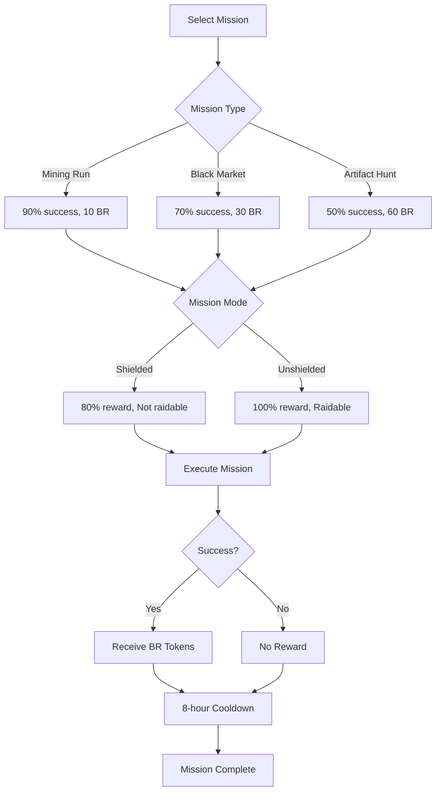

#### Mission Types & Rewards

| Mission Type | Success Rate | Base Reward | Risk Level | Duration |
|--------------|--------------|-------------|------------|----------|
| Mining Run | 90% | 10 BR | Low | 2-3 hours |
| Black Market | 70% | 30 BR | Medium | 3-4 hours |
| Artifact Hunt | 50% | 60 BR | High | 4-6 hours |

#### Mission Modes

- **🛡️ Shielded Mode**
  - 80% of base reward
  - Cannot be raided by other players
  - Safe but lower profits

- **🔓 Unshielded Mode**
  - 100% of base reward
  - Vulnerable to player raids
  - Higher risk, higher reward

### ⚔️ Raid System

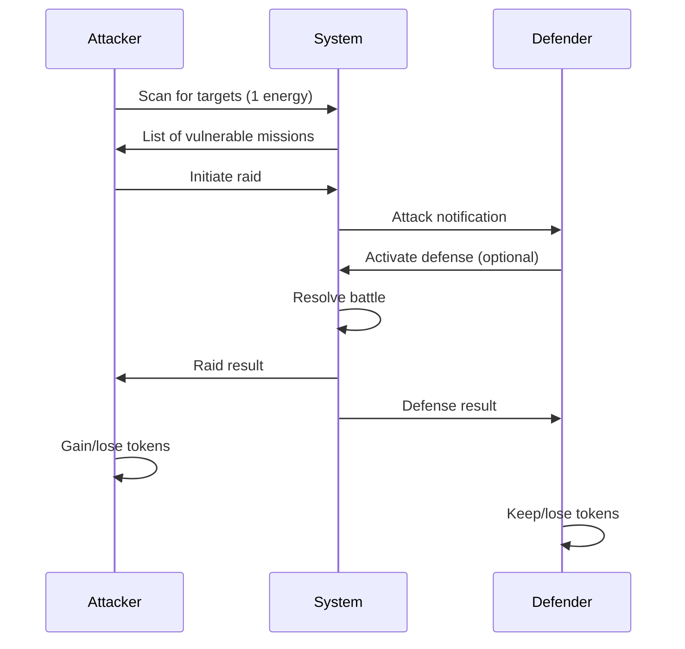

#### Raid Mechanics

1. **Energy Cost**: 1 energy per scan (max 10, refills 1/hour)
2. **Target Selection**: Only unshielded missions are vulnerable
3. **Battle Resolution**: Automatic with visual combat simulation
4. **Rewards**: Steal 100% of mission reward if successful
5. **Consequences**: Failed raids waste energy, successful defenses may reward defenders

### 🛠️ Ship Upgrade System

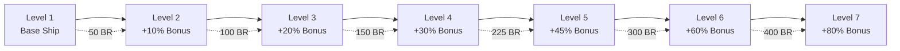

| Level | Reward Bonus | Cooldown | Upgrade Cost | Total Investment |
|-------|--------------|----------|--------------|------------------|
| 1 | 1.0× | 8h | - | 0 BR |
| 2 | 1.1× | 7.5h | 50 BR | 50 BR |
| 3 | 1.2× | 7h | 100 BR | 150 BR |
| 4 | 1.3× | 6.5h | 150 BR | 300 BR |
| 5 | 1.45× | 6h | 225 BR | 525 BR |
| 6 | 1.6× | 5.5h | 300 BR | 825 BR |
| 7 | 1.8× | 5h | 400 BR | 1,225 BR |

## 🔐 Authentication System

### Authentication Flow

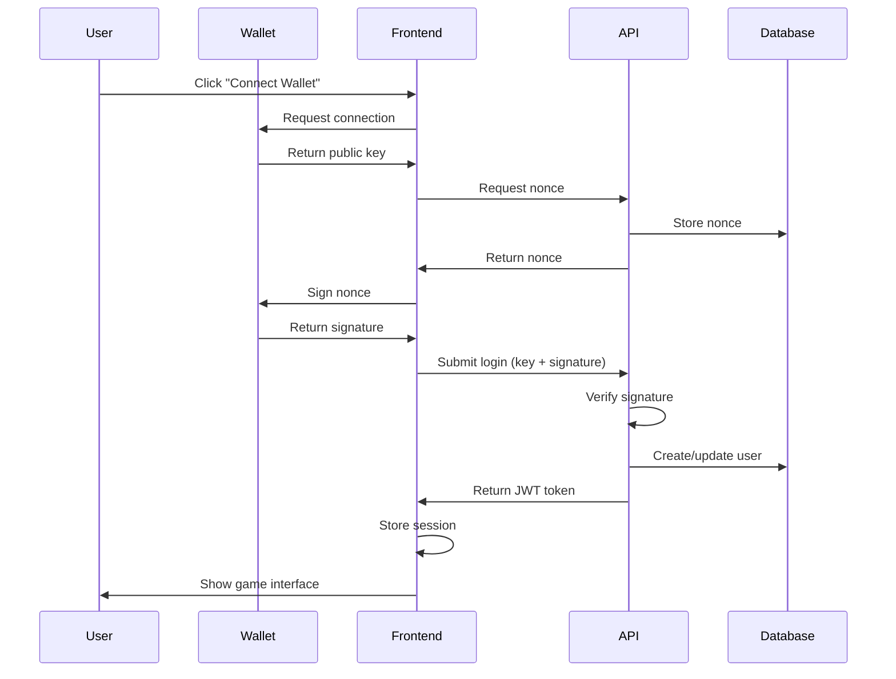

### Supported Wallets

| Wallet | Type | Features | Status |
|--------|------|----------|--------|
| **Phantom** | Browser Extension | Most popular, easy setup | ✅ Fully Supported |
| **Solflare** | Web/Extension | Advanced features | ✅ Fully Supported |
| **Glow** | Mobile/Web | Mobile-first design | ✅ Fully Supported |
| **Backpack** | Social Wallet | Social features | ✅ Fully Supported |
| **Coin98** | Multi-chain | Multiple blockchains | ✅ Fully Supported |

### Security Features

- **Cryptographic Signatures**: No passwords, only wallet signatures
- **Nonce-based Authentication**: Prevents replay attacks
- **JWT Token Management**: Secure, stateless authentication
- **Auto-renewal**: Seamless session management
- **Multi-device Support**: Same wallet, multiple devices

## 💰 Game Economy

### Token Flow Diagram

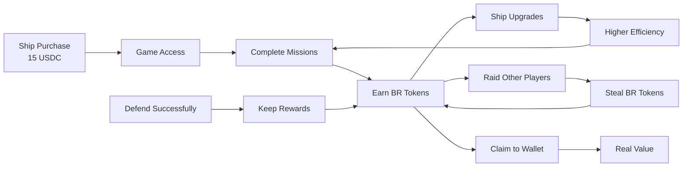

### BR Token Sources

1. **Mission Rewards**
   - Mining Run: 10 BR (90% success rate)
   - Black Market: 30 BR (70% success rate)
   - Artifact Hunt: 60 BR (50% success rate)

2. **Successful Raids**
   - Steal 100% of target's mission reward
   - Only works on unshielded missions

3. **Defense Bonuses**
   - Bonus rewards for successfully defending against raids
   - Reputation improvements

### BR Token Expenses

1. **Ship Upgrades**
   - Levels 2-7: 50-400 BR per level
   - Permanent improvements to efficiency

2. **Future Features** (Planned)
   - Special equipment and weapons
   - Cosmetic ship modifications
   - Consumable battle items
   - Guild membership fees

### Economic Balance

- **Entry Cost**: 15 USDC one-time ship purchase
- **Daily Earning Potential**: 50-200 BR (depending on ship level and strategy)
- **Upgrade ROI**: 10-20 missions to recover upgrade costs
- **Risk/Reward**: Higher rewards require higher risk (unshielded missions)

## 🌐 APIs & Services

### REST API Endpoints

**Base URL**: `https://api.bonkraiders.com/api.php`

#### Authentication Endpoints

```http
POST /api.php?action=auth/nonce
Content-Type: application/json

{
  "publicKey": "string"
}

Response:
{
  "nonce": "string"
}
```

```http
POST /api.php?action=auth/login
Content-Type: application/json

{
  "publicKey": "string",
  "nonce": "string", 
  "signature": "string"
}

Response:
{
  "token": "jwt_token_string"
}
```

#### Game Endpoints

```http
POST /api.php?action=buy_ship
Authorization: Bearer <jwt_token>

Response:
{
  "ship_id": "number",
  "already_owned": "boolean"
}
```

```http
POST /api.php?action=send_mission
Authorization: Bearer <jwt_token>
Content-Type: application/json

{
  "type": "MiningRun|BlackMarket|ArtifactHunt",
  "mode": "Shielded|Unshielded",
  "signedBurnTx": "string"
}

Response:
{
  "success": "boolean",
  "reward": "number",
  "br_balance": "number"
}
```

```http
POST /api.php?action=raid/scan
Authorization: Bearer <jwt_token>

Response:
{
  "missions": [
    {
      "id": "number",
      "type": "string",
      "mode": "string", 
      "reward": "number",
      "owner": "string"
    }
  ],
  "remainingEnergy": "number"
}
```

### Service Architecture

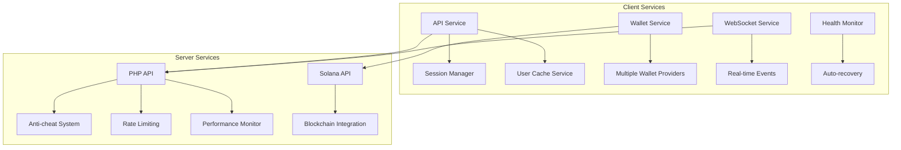

### Error Handling

The API uses standardized error responses:

```json
{
  "error": "Error message description",
  "code": "ERROR_CODE",
  "details": "Additional error context"
}
```

Common error codes:
- `AUTHENTICATION_REQUIRED`: Missing or invalid JWT token
- `INSUFFICIENT_ENERGY`: Not enough energy for raid
- `MISSION_COOLDOWN`: Ship still on cooldown
- `INVALID_TARGET`: Raid target no longer available
- `RATE_LIMIT_EXCEEDED`: Too many requests

## 🎨 User Interface

### Design System

#### Color Palette
- **Primary Green**: `#0f0` - Main UI elements
- **Accent Cyan**: `#0cf` - Highlights and accents  
- **Warning Yellow**: `#ff0` - Warnings and important info
- **Error Red**: `#f00` - Errors and danger states
- **Background Black**: `#000` - Main background
- **Panel Dark**: `rgba(0,40,0,0.8)` - UI panels

#### Typography
- **Font Family**: 'Press Start 2P' (Retro pixel font)
- **Sizes**: 8px-24px for various UI elements
- **Line Height**: 1.2-1.5 for readability

#### Component System

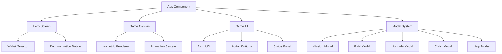

### Responsive Design

- **Desktop**: Full-featured interface with tooltips
- **Tablet**: Adapted layout with touch-friendly controls
- **Mobile**: Simplified UI with essential features only

### Accessibility Features

- **High Contrast**: Retro green-on-black theme
- **Keyboard Navigation**: Full keyboard support
- **Screen Reader**: Semantic HTML structure
- **Touch Friendly**: Large tap targets on mobile

## 🔒 Security

### Multi-Layer Security Architecture

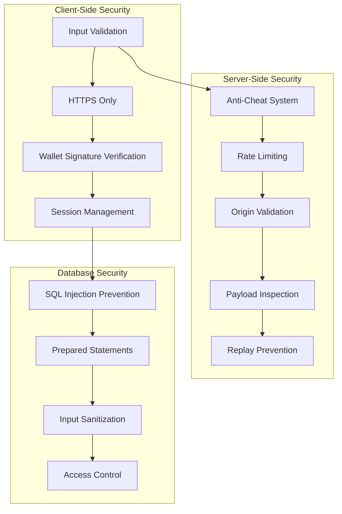

### Anti-Cheat Measures

1. **Cooldown Enforcement**
   - Server-side validation of mission timing
   - Cannot bypass 8-hour cooldowns

2. **Daily Limits**
   - Maximum 10 missions per 24 hours
   - Prevents automated farming

3. **Reward Validation**
   - Server calculates all rewards
   - Client cannot manipulate earnings

4. **Replay Attack Prevention**
   - Transaction hash tracking
   - Prevents duplicate submissions

5. **Origin Validation**
   - CORS headers verification
   - Referrer checking

### Rate Limiting

- **60 requests per minute** per IP address
- **Exponential backoff** for repeated violations
- **Whitelist system** for trusted sources

### Data Protection

- **No sensitive data storage** on client
- **JWT tokens** with expiration
- **Encrypted communication** (HTTPS only)
- **Minimal data collection** (wallet addresses only)

## 📊 Database Schema

### Entity Relationship Diagram

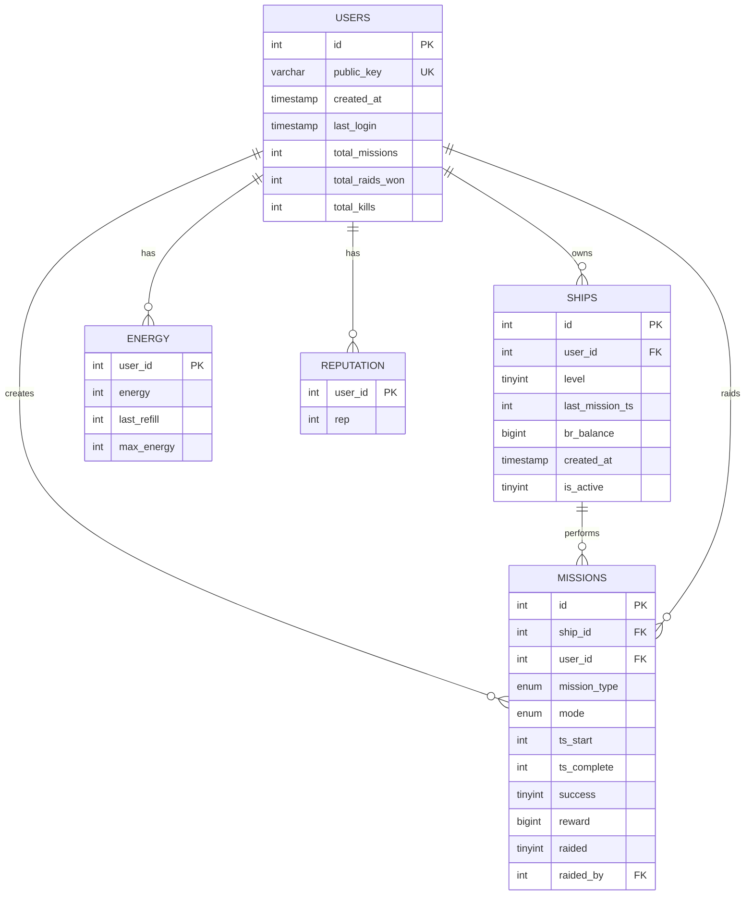

### Key Tables

#### Users Table
- **Primary Key**: `id` (auto-increment)
- **Unique Key**: `public_key` (Solana wallet address)
- **Indexes**: `public_key` for fast lookups
- **Stats**: Mission count, raid wins, kills

#### Ships Table
- **Foreign Key**: `user_id` references users
- **Game State**: Level, balance, last mission timestamp
- **Soft Delete**: `is_active` flag for deactivation

#### Missions Table
- **Complex Relations**: Ship, user, and optional raider
- **State Tracking**: Start time, completion, success status
- **Raid System**: Tracks if mission was raided and by whom

#### Security Tables
- **Nonces**: Temporary authentication challenges
- **API Logs**: Rate limiting and monitoring
- **User Sessions**: JWT token management

## 🚀 Deployment

### Production Architecture

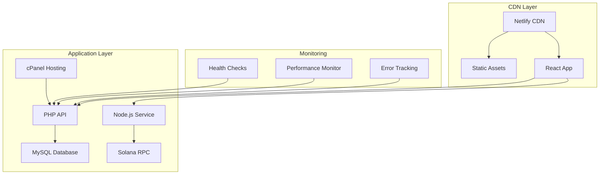

### Deployment Process

#### Frontend Deployment (Netlify)

```bash
# Build production assets
npm run build

# Deploy to Netlify (automatic via Git)
git push origin main
```

**Netlify Configuration:**
- **Build Command**: `npm run build`
- **Publish Directory**: `dist`
- **Environment Variables**: Set in Netlify dashboard
- **Custom Domain**: `bonkraiders.com`

#### Backend Deployment (cPanel)

1. **File Upload**: Upload PHP files to public_html
2. **Database Setup**: Import SQL migrations
3. **Environment Config**: Set database credentials
4. **SSL Certificate**: Enable HTTPS
5. **Cron Jobs**: Set up maintenance tasks

### Environment Configuration

#### Production Environment Variables

```env
# Frontend (.env.production)
VITE_API_BASE_URL=https://api.bonkraiders.com
VITE_VERIFY_API_URL=https://verify.bonkraiders.com
VITE_SOLANA_RPC_URL=https://api.mainnet-beta.solana.com
VITE_DEBUG_MODE=false

# Backend (api.php)
DB_HOST=localhost
DB_NAME=bonka_bonkartio
DB_USER=production_user
DB_PASS=secure_password
JWT_SECRET=very_secure_jwt_secret
```

### Monitoring & Maintenance

- **Health Checks**: Automated system status monitoring
- **Performance Tracking**: Response time and error rate monitoring
- **Auto-healing**: Automatic recovery from common issues
- **Backup Strategy**: Daily database backups
- **Update Process**: Staged deployment with rollback capability

## 🐛 Debugging & Monitoring

### Debug Mode Features

When `VITE_DEBUG_MODE=true`:

```javascript
// Extensive console logging
console.log('🔧 Environment Configuration:', ENV);
console.log('📡 API Request:', { url, method, hasAuth });
console.log('✅ Authentication successful for:', publicKey);

// Performance monitoring
console.log('⏱️ API Response time:', responseTime + 'ms');
console.log('💾 Memory usage:', memoryUsage + 'MB');
```

### Error Tracking

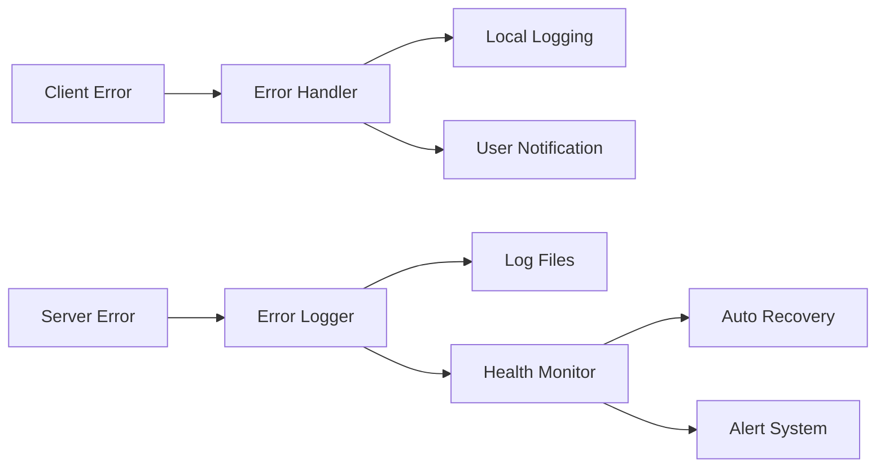

### Monitoring Dashboard

Key metrics tracked:
- **API Response Times**: Average and 95th percentile
- **Error Rates**: 4xx and 5xx responses
- **User Activity**: Active players and session duration
- **Database Performance**: Query times and connection pool
- **Blockchain Status**: Solana network health

### Common Issues & Solutions

| Issue | Symptoms | Solution |
|-------|----------|----------|
| Wallet Connection Failed | "No wallet detected" | Install wallet extension, refresh page |
| API Timeout | Slow loading, timeouts | Check network, retry request |
| Mission Cooldown | "Ship on cooldown" | Wait for cooldown period to expire |
| Insufficient Energy | "Not enough energy" | Wait for energy regeneration |
| Database Connection | 500 errors | Check database credentials and connection |

## 📈 Current Status

### ✅ Completed Features (90% Complete)

#### Core Game Systems
- [x] **Wallet Integration** - Multi-wallet support with auto-detection
- [x] **Authentication System** - Secure signature-based login
- [x] **Mission System** - 3 mission types with success/failure mechanics
- [x] **Raid System** - Player vs player mission attacks
- [x] **Ship Upgrades** - 7-tier progression system
- [x] **Token Economy** - BR token earning and spending
- [x] **Anti-Cheat Protection** - Server-side validation and security

#### User Interface
- [x] **Retro Pixel Design** - Complete visual theme
- [x] **Responsive Layout** - Desktop and mobile support
- [x] **Interactive Canvas** - Isometric game world
- [x] **Modal System** - Mission, raid, upgrade interfaces
- [x] **Real-time Updates** - Live balance and status updates

#### Technical Infrastructure
- [x] **REST API** - Complete backend functionality
- [x] **Database Schema** - Full data model implementation
- [x] **Performance Monitoring** - Health checks and auto-healing
- [x] **Security Systems** - Rate limiting and input validation
- [x] **Deployment Pipeline** - Production-ready hosting

### 🔄 In Progress (10% Complete)

#### Real-Time Features
- [ ] **WebSocket Server** - Live communication infrastructure
- [ ] **Raid Notifications** - Real-time attack alerts
- [ ] **Player Presence** - Online/offline status indicators

### 🎯 Testing Status

- [x] **Frontend Components** - All UI components tested
- [x] **API Endpoints** - All endpoints functional
- [x] **Wallet Integration** - Multiple wallets tested
- [x] **Game Mechanics** - Mission and raid systems verified
- [ ] **Load Testing** - Performance under high load
- [ ] **Security Audit** - Professional security review

## 🔮 Roadmap

### Phase 1: Core Completion (Current - Q1 2025)
- [ ] **WebSocket Implementation** - Real-time communication
- [ ] **Mobile Optimization** - Touch controls and responsive design
- [ ] **Performance Optimization** - Faster loading and smoother gameplay
- [ ] **Security Audit** - Professional security review
- [ ] **Beta Testing** - Limited user testing program

### Phase 2: Enhanced Gameplay (Q2 2025)
- [ ] **Guild System** - Player alliances and cooperation
- [ ] **Advanced Battle System** - More complex combat mechanics
- [ ] **Achievement System** - Progress tracking and rewards
- [ ] **Leaderboards** - Global and seasonal rankings
- [ ] **Special Events** - Limited-time challenges and rewards

### Phase 3: Ecosystem Expansion (Q3 2025)
- [ ] **NFT Integration** - Unique ships and equipment
- [ ] **Marketplace** - Player-to-player trading
- [ ] **Staking Rewards** - Passive income for token holders
- [ ] **DAO Governance** - Community-driven development
- [ ] **Cross-chain Support** - Multi-blockchain compatibility

### Phase 4: Advanced Features (Q4 2025)
- [ ] **VR/AR Support** - Immersive gameplay experiences
- [ ] **AI Opponents** - Intelligent computer enemies
- [ ] **Procedural Content** - Randomly generated missions and worlds
- [ ] **Esports Integration** - Competitive tournaments and leagues
- [ ] **Mobile App** - Native iOS and Android applications

### Long-term Vision (2026+)
- [ ] **Metaverse Integration** - Virtual world connectivity
- [ ] **Real-world Rewards** - Physical merchandise and experiences
- [ ] **Educational Content** - Blockchain and gaming tutorials
- [ ] **Developer SDK** - Third-party game development tools
- [ ] **Global Expansion** - Multi-language and regional support

## 🤝 Contributing

### Development Workflow

1. **Fork the Repository**
   ```bash
   git fork https://github.com/bonkraiders/bonk-raiders
   cd bonk-raiders
   ```

2. **Create Feature Branch**
   ```bash
   git checkout -b feature/your-feature-name
   ```

3. **Make Changes**
   - Follow existing code style and patterns
   - Add tests for new functionality
   - Update documentation as needed

4. **Test Changes**
   ```bash
   npm run test
   npm run build
   ```

5. **Submit Pull Request**
   - Provide clear description of changes
   - Include screenshots for UI changes
   - Reference any related issues

### Code Standards

#### Frontend (React/JavaScript)
- **ES6+ Syntax** - Use modern JavaScript features
- **Functional Components** - Prefer hooks over class components
- **Modular Architecture** - Keep components small and focused
- **Error Boundaries** - Handle errors gracefully
- **Performance** - Optimize for speed and memory usage

#### Backend (PHP)
- **PSR Standards** - Follow PHP coding standards
- **Security First** - Validate all inputs and sanitize outputs
- **Error Handling** - Comprehensive error management
- **Documentation** - Comment complex logic and APIs
- **Testing** - Unit tests for critical functions

#### Database (MySQL)
- **Normalized Schema** - Avoid data duplication
- **Indexed Queries** - Optimize for performance
- **Migration Scripts** - Version-controlled schema changes
- **Backup Strategy** - Regular automated backups
- **Security** - Principle of least privilege

### Bug Reports

When reporting bugs, please include:
- **Environment**: Browser, OS, wallet type
- **Steps to Reproduce**: Detailed reproduction steps
- **Expected Behavior**: What should happen
- **Actual Behavior**: What actually happens
- **Screenshots**: Visual evidence if applicable
- **Console Logs**: Any error messages

### Feature Requests

For new features, please provide:
- **Use Case**: Why is this feature needed?
- **User Story**: How would users interact with it?
- **Technical Requirements**: Any specific technical needs
- **Priority**: How important is this feature?
- **Alternatives**: Other ways to solve the problem

---

**Bonk Raiders** - Explore. Raid. Earn. 🚀

*Built with ❤️ by the Bonk Raiders development team*

*Last updated: December 2024*