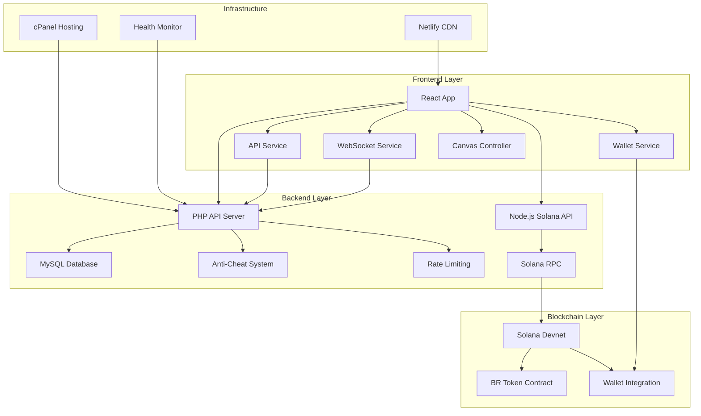
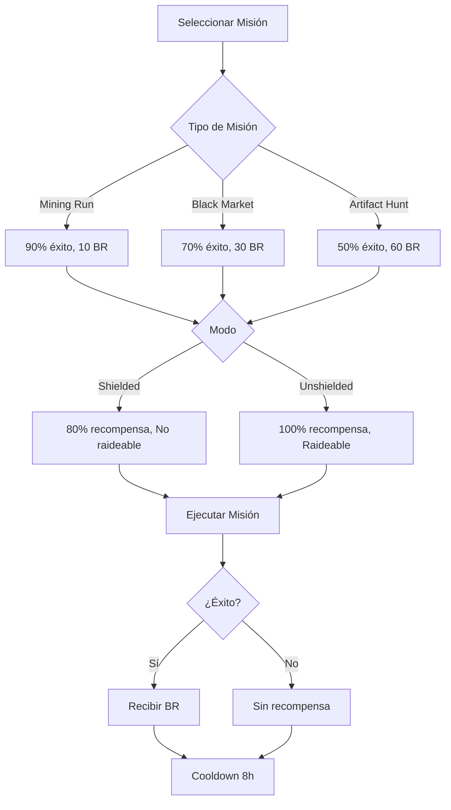
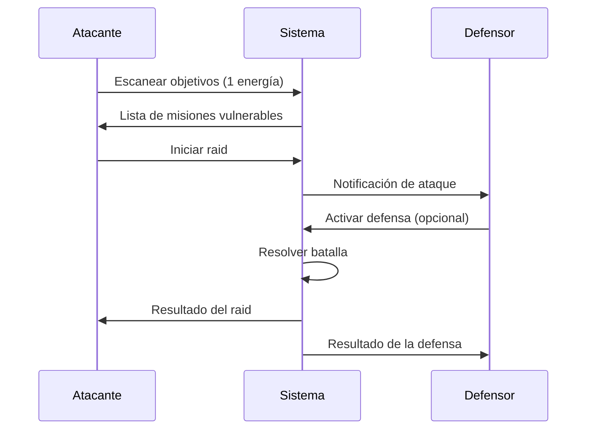
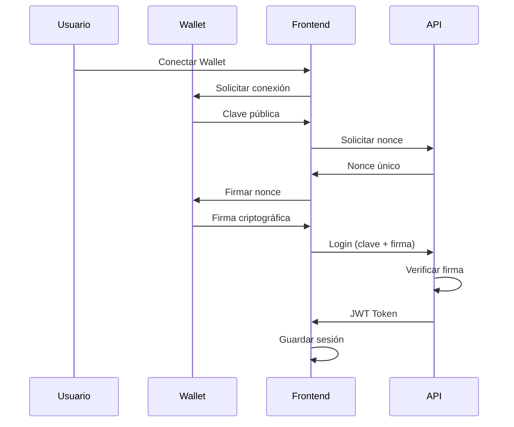
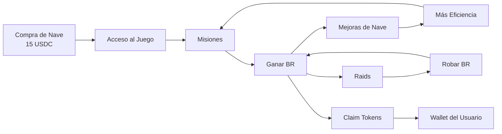

# 🚀 Bonk Raiders - Blockchain Space Raiding Game

```
 _______     ______    _____  ___   __   ___                                     
|   _  "\   /    " \  (\"   \|"  \ |/"| /  ")                                    
(. |_)  :) // ____  \ |.\\   \    |(: |/   /                                     
|:     \/ /  /    ) :)|: \.   \\  ||    __/                                      
(|  _  \\(: (____/ // |.  \    \. |(// _  \                                      
|: |_)  :)\        /  |    \    \ ||: | \  \                                     
(_______/  \"_____/    \___|\____\)(__|  \__)                                    
                                                                                 
      _______        __        __     ________    _______   _______    ________  
     /"      \      /""\      |" \   |"      "\  /"     "| /"      \  /"       ) 
    |:        |    /    \     ||  |  (.  ___  :)(: ______)|:        |(:   \___/  
    |_____/   )   /' /\  \    |:  |  |: \   ) || \/    |  |_____/   ) \___  \    
     //      /   //  __'  \   |.  |  (| (___\ || // ___)_  //      /   __/  \\   
    |:  __   \  /   /  \\  \  /\  |\ |:       :)(:      "||:  __   \  /" \   :)  
    |__|  \___)(___/    \___)(__\_|_)(________/  \_______)|__|  \___)(_______/   
```

## 📋 Tabla de Contenidos

- [🎮 Descripción del Proyecto](#-descripción-del-proyecto)
- [🏗️ Arquitectura del Sistema](#️-arquitectura-del-sistema)
- [🛠️ Stack Tecnológico](#️-stack-tecnológico)
- [📁 Estructura del Proyecto](#-estructura-del-proyecto)
- [🎯 Características Principales](#-características-principales)
- [🔧 Configuración e Instalación](#-configuración-e-instalación)
- [🎮 Mecánicas de Juego](#-mecánicas-de-juego)
- [🔐 Sistema de Autenticación](#-sistema-de-autenticación)
- [💰 Economía del Juego](#-economía-del-juego)
- [🌐 APIs y Servicios](#-apis-y-servicios)
- [🎨 Interfaz de Usuario](#-interfaz-de-usuario)
- [🔒 Seguridad](#-seguridad)
- [📊 Base de Datos](#-base-de-datos)
- [🚀 Despliegue](#-despliegue)
- [🐛 Debugging y Logs](#-debugging-y-logs)
- [📈 Estado Actual](#-estado-actual)
- [🔮 Próximos Pasos](#-próximos-pasos)
- [🤝 Contribución](#-contribución)

## 🎮 Descripción del Proyecto

**Bonk Raiders** es un juego de estrategia espacial en tiempo real construido sobre la blockchain de Solana. Los jugadores pueden:

- 🛸 **Comprar y mejorar naves espaciales**
- 🎯 **Realizar misiones para ganar tokens BR**
- ⚔️ **Atacar misiones de otros jugadores**
- 🛡️ **Defender su base de ataques enemigos**
- 💰 **Gestionar una economía basada en tokens**

El juego combina elementos de estrategia, gestión de recursos y mecánicas PvP en un entorno blockchain descentralizado.

## 🏗️ Arquitectura del Sistema



## 🛠️ Stack Tecnológico

### Frontend
- **React 18** - Framework principal
- **Vite** - Build tool y dev server
- **Vanilla CSS** - Estilos con tema retro pixelado
- **Canvas API** - Renderizado del juego isométrico
- **@solana/web3.js** - Integración con Solana

### Backend
- **PHP 7.4+** - API REST principal
- **MySQL/MariaDB** - Base de datos principal
- **Node.js** - Microservicio para Solana
- **JWT** - Autenticación sin estado

### Blockchain
- **Solana Devnet** - Red blockchain
- **SPL Tokens** - Tokens BR del juego
- **Phantom/Solflare** - Wallets soportadas

### Infraestructura
- **Netlify** - Hosting del frontend
- **cPanel** - Hosting del backend
- **WebSockets** - Comunicación en tiempo real

## 📁 Estructura del Proyecto

```
bonk-raiders/
├── 📁 src/                          # Frontend React
│   ├── 📁 components/               # Componentes React
│   │   ├── 📁 modals/              # Modales del juego
│   │   ├── GameCanvas.jsx          # Canvas principal
│   │   ├── GameUI.jsx              # Interfaz de usuario
│   │   └── HeroScreen.jsx          # Pantalla de inicio
│   ├── 📁 services/                # Servicios del cliente
│   │   ├── apiService.js           # Cliente API REST
│   │   ├── walletService.js        # Gestión de wallets
│   │   ├── websocketService.js     # WebSockets
│   │   └── sessionManager.js       # Gestión de sesiones
│   ├── 📁 utils/                   # Utilidades
│   │   ├── canvasController.js     # Lógica del canvas
│   │   ├── gameLogic.js            # Lógica principal
│   │   └── shipAnimator.js         # Animaciones
│   └── 📁 config/                  # Configuración
│       └── environment.js          # Variables de entorno
├── 📁 Server/                       # Backend PHP
│   ├── api.php                     # API principal
│   ├── anti_cheat.php              # Sistema anti-trampas
│   ├── hacker_protect.php          # Protección de seguridad
│   └── 📁 solana-api/              # Microservicio Node.js
├── 📁 database/                     # Esquemas de BD
│   └── migrations.sql              # Migraciones SQL
├── 📁 public/                       # Assets estáticos
│   └── 📁 assets/                  # Sprites e imágenes
└── 📁 app/                         # Versión vanilla (legacy)
```

## 🎯 Características Principales

### ✅ Implementadas

#### 🎮 Sistema de Juego
- [x] **Canvas isométrico** con renderizado 2.5D
- [x] **Animaciones de naves** (despegue, viaje, aterrizaje)
- [x] **Sistema de batallas** con soldados y mechs
- [x] **Efectos visuales** y partículas

#### 🔐 Autenticación
- [x] **Múltiples wallets** (Phantom, Solflare, Glow, etc.)
- [x] **Autenticación por firma** criptográfica
- [x] **JWT tokens** con renovación automática
- [x] **Gestión de sesiones** persistentes

#### 🎯 Mecánicas de Juego
- [x] **3 tipos de misiones** (Mining, Black Market, Artifact Hunt)
- [x] **2 modos de misión** (Shielded/Unshielded)
- [x] **Sistema de raids** entre jugadores
- [x] **7 niveles de mejoras** de nave
- [x] **Sistema de energía** para raids

#### 💰 Economía
- [x] **Tokens BR** como moneda del juego
- [x] **Compra de naves** (15 USDC equivalente)
- [x] **Recompensas por misiones** exitosas
- [x] **Robo de tokens** mediante raids

#### 🛡️ Seguridad
- [x] **Sistema anti-trampas** robusto
- [x] **Rate limiting** por IP
- [x] **Validación de origen** de requests
- [x] **Prevención de replay** de transacciones

### 🔄 En Desarrollo

#### 🌐 Comunicación en Tiempo Real
- [ ] **WebSocket server** funcional
- [ ] **Notificaciones de raids** en vivo
- [ ] **Estado de jugadores** en tiempo real
- [ ] **Chat del juego**

#### 🎮 Características Avanzadas
- [ ] **Batallas PvP** en tiempo real
- [ ] **Guilds/Alianzas** de jugadores
- [ ] **Eventos especiales** temporales
- [ ] **Leaderboards** globales

## 🔧 Configuración e Instalación

### Prerrequisitos

```bash
# Node.js 16+
node --version

# npm o yarn
npm --version

# PHP 7.4+
php --version

# MySQL/MariaDB
mysql --version
```

### 1. Configuración del Frontend

```bash
# Clonar el repositorio
git clone <repository-url>
cd bonk-raiders

# Instalar dependencias
npm install

# Configurar variables de entorno
cp .env.example .env
```

**Variables de entorno (.env):**
```env
# API Configuration
VITE_API_BASE_URL=https://api.bonkraiders.com
VITE_VERIFY_API_URL=https://verify.bonkraiders.com

# Solana Configuration
VITE_SOLANA_RPC_URL=https://api.devnet.solana.com
VITE_SOLANA_NETWORK=devnet

# Game Configuration
VITE_GAME_TOKEN_MINT=CCmGDrD9jZarDEz1vrjKcE9rrJjL8VecDYjAWxhwhGPo
VITE_SHIP_PRICE_SOL=0.01

# Development
VITE_DEBUG_MODE=true
```

### 2. Configuración del Backend

```php
// Server/api.php - Configuración de base de datos
define('DB_HOST', 'localhost');
define('DB_NAME', 'bonka_bonkartio');
define('DB_USER', 'tu_usuario');
define('DB_PASS', 'tu_contraseña');
define('JWT_SECRET', 'tu_jwt_secret_muy_seguro');
```

### 3. Base de Datos

```sql
-- Ejecutar migraciones
mysql -u usuario -p bonka_bonkartio < database/migrations.sql
```

### 4. Ejecutar en Desarrollo

```bash
# Frontend
npm run dev

# Backend (si usas servidor local)
php -S localhost:8000 Server/api.php
```

## 🎮 Mecánicas de Juego

### 🚀 Sistema de Misiones



### ⚔️ Sistema de Raids



### 🛠️ Sistema de Mejoras

| Nivel | Bonus | Cooldown | Costo | Total Acumulado |
|-------|-------|----------|-------|-----------------|
| 1     | 1.0×  | 8h       | -     | 0 BR           |
| 2     | 1.1×  | 7.5h     | 50 BR | 50 BR          |
| 3     | 1.2×  | 7h       | 100 BR| 150 BR         |
| 4     | 1.3×  | 6.5h     | 150 BR| 300 BR         |
| 5     | 1.45× | 6h       | 225 BR| 525 BR         |
| 6     | 1.6×  | 5.5h     | 300 BR| 825 BR         |
| 7     | 1.8×  | 5h       | 400 BR| 1,225 BR       |

## 🔐 Sistema de Autenticación

### Flujo de Autenticación



### Wallets Soportadas

- **Phantom** - Wallet principal recomendada
- **Solflare** - Wallet web y extensión
- **Glow** - Wallet móvil y web
- **Backpack** - Wallet social
- **Coin98** - Wallet multi-chain

## 💰 Economía del Juego

### Token BR (Bonk Raiders)



### Fuentes de Ingresos BR

1. **Misiones Exitosas**
   - Mining Run: 10 BR (90% éxito)
   - Black Market: 30 BR (70% éxito)
   - Artifact Hunt: 60 BR (50% éxito)

2. **Raids Exitosos**
   - Robar 100% de la recompensa de misión
   - Solo misiones Unshielded

3. **Defensa Exitosa**
   - Bonus por repeler ataques
   - Mantener recompensas propias

### Gastos BR

1. **Mejoras de Nave**
   - Niveles 2-7: 50-400 BR por nivel

2. **Futuras Características**
   - Equipamiento especial
   - Consumibles de batalla
   - Cosméticos de nave

## 🌐 APIs y Servicios

### API REST Principal (PHP)

**Base URL:** `https://api.bonkraiders.com/api.php`

#### Autenticación
```http
POST /api.php?action=auth/nonce
Content-Type: application/json

{
  "publicKey": "string"
}
```

```http
POST /api.php?action=auth/login
Content-Type: application/json

{
  "publicKey": "string",
  "nonce": "string",
  "signature": "string"
}
```

#### Juego
```http
POST /api.php?action=buy_ship
Authorization: Bearer <jwt_token>
```

```http
POST /api.php?action=send_mission
